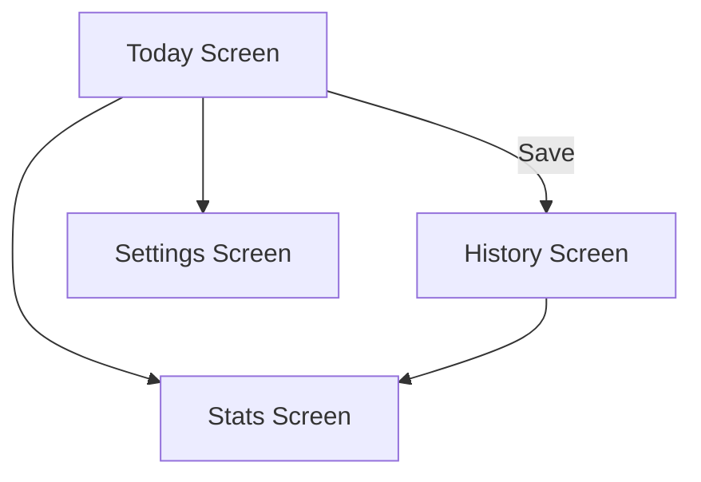

<<<<<<< HEAD

# 📓 Daily Mood Journal

A complete Flutter application for daily emotion tracking, journaling, analytics, and reminders.  
Designed with Provider state management, SQLite local database, and modular Flutter architecture.

---

## ✨ Features
- 🌞 Daily mood logging with notes  
- 📅 History of past entries  
- 📊 Statistics dashboard (mood frequency & summary)  
- 🔔 Daily reminder notifications  
- 🌙 Light/Dark mode  
- 💾 Offline-first local SQLite storage  
- 🧩 Clean modular architecture (models, providers, screens, widgets)

---

## 🛠️ Tech Stack
- **Flutter**  
- **Dart**  
- **Provider** (state management)  
- **SQLite (sqflite)**  
- **flutter_local_notifications**  

---

## 📁 Project Structure
```
lib/
├── main.dart
│
├── models/
│   └── mood_entry.dart
│
├── providers/
│   ├── mood_provider.dart
│   └── settings_provider.dart
│
├── screens/
│   ├── today_screen.dart
│   ├── history_screen.dart
│   ├── stats_screen.dart
│   └── settings_screen.dart
│
├── widgets/
│   ├── entry_card.dart
│   └── mood_picker.dart
│
├── db/
│   └── app_database.dart
│
└── utils/
    ├── date_utils.dart
    └── notifications.dart
```

---

## 🧩 Component Overview

### **Models**
- **mood_entry.dart** — MoodEntry model with id, date, moodValue, note  
  Includes: `toMap()`, `fromMap()` for database usage  

### **Providers**
- **mood_provider.dart** — CRUD for mood entries + today's entry logic  
- **settings_provider.dart** — Theme mode & notification settings  

### **Screens**
- **today_screen.dart** — Record today’s mood  
- **history_screen.dart** — List of past entries  
- **stats_screen.dart** — Mood frequency summary  
- **settings_screen.dart** — Theme & notification settings  

### **Widgets**
- **entry_card.dart** — Mood log card for history  
- **mood_picker.dart** — Mood selector UI  

### **Database**
- **app_database.dart** — SQLite initialization, create table, insert/query moods  

### **Utils**
- **date_utils.dart** — Date formatting helpers  
- **notifications.dart** — Local notifications setup & scheduling  

---

## 📲 UI Flow (Mermaid)


---

## 🗄 Database Schema
### **Table: mood_entries**
| Column     | Type    |
|------------|---------|
| id         | INTEGER PRIMARY KEY |
| date       | TEXT    |
| moodValue  | INTEGER |
| note       | TEXT    |

---

## 🚀 Getting Started

### Install packages:
```
flutter pub get
```

### Run:
```
flutter run
```

### Build Release:
```
flutter build apk --release
```

---

## 🔮 Future Improvements
- Firebase sync  
- Better charts  
- Export PDF  
- Widgets for Android/iOS  
- Mood trends AI analysis  

---

## 📜 License
MIT License — free to use & modify.

---

## 👩‍💻 Credits
Developed by **Supitsara T. (Chat)**  
Project for learning Flutter development & emotional tracking.
=======
📓 Daily Mood Journal

A Flutter application designed to help users track their daily mood, write reflections, review emotional history, and view simple mood statistics. The app uses a local database, Provider state management, and optional notifications to remind users to log their mood daily.

⸻

✨ Features
 • Record Today’s Mood
Choose mood type, write notes, and save today’s entry.
 • History View
See all past mood entries in a clean list.
 • Statistics Dashboard
Simple mood summary & frequency analysis.
 • Local Database (SQLite)
All moods saved locally using sqflite.
 • Provider State Management
Mood state and settings handled through Providers.
 • Daily Reminders (Notifications)
Local notifications to remind users to journal.
 • Clean Modular Architecture
Separate models, screens, utilities, database helper, and widgets.

⸻

📁 Project Structure

lib/
├── main.dart                     # App entry point
│
├── models/
│   └── mood_entry.dart           # Data model for storing mood records
│
├── providers/
│   ├── mood_provider.dart        # Handles mood CRUD operations
│   └── settings_provider.dart    # Manages app settings (theme, notifications)
│
├── screens/
│   ├── today_screen.dart         # Main screen to input today's mood
│   ├── history_screen.dart       # View past mood entries
│   ├── stats_screen.dart         # Mood analytics + summary
│   └── settings_screen.dart      # App settings (theme, reminders)
│
├── widgets/
│   ├── entry_card.dart           # UI card for mood entries
│   └── mood_picker.dart          # Mood selection widget (icons / emojis)
│
├── db/
│   └── app_database.dart         # SQLite database setup & queries
│
└── utils/
    ├── date_utils.dart           # Date formatting helper functions
    └── notifications.dart        # Local notification setup & triggers


⸻

🛠️ Technologies Used

Category Technology
Framework Flutter
Language Dart
State Management Provider
Database SQLite (sqflite)
Notifications flutter_local_notifications
Architecture MVVM-style (Provider + Models + Screens)


⸻

🚀 Getting Started

1️⃣ Install dependencies

flutter pub get

2️⃣ Run the app

flutter run

3️⃣ Build release APK

flutter build apk --release


⸻

📦 Main Components

📌 MoodEntry Model (models/mood_entry.dart)

Defines:
 • mood (enum/int)
 • date
 • note
 • toMap / fromMap for SQLite

📌 MoodProvider (providers/mood_provider.dart)

Handles:
 • Load mood history
 • Insert new mood entry
 • Get today’s entry
 • Provide data to UI

📌 SettingsProvider (providers/settings_provider.dart)

Handles:
 • Theme mode (light/dark)
 • Notification scheduling
 • User preferences

📌 AppDatabase (db/app_database.dart)

Controls:
 • Database initialization
 • Table creation
 • CRUD operations

📌 Notifications (utils/notifications.dart)

Handles:
 • Permission request
 • Schedule daily reminders

📌 UI Screens
 • today_screen.dart – record today’s mood
 • history_screen.dart – timeline of past entries
 • stats_screen.dart – mood statistics
 • settings_screen.dart – theme + notifications

⸻

📊 Stats & Analytics

The app includes a simple statistics screen that shows:
 • Mood count
 • Mood frequency
 • Simple charts (if implemented)

⸻

🧩 Widgets

Reusable components for clean UI:
 • entry_card.dart – card for mood display
 • mood_picker.dart – UI selector of mood icons/emojis

⸻

🌙 Dark Mode Support

Theme settings handled by SettingsProvider.

⸻

🔔 Daily Notification Reminder

Users can enable reminders to log moods every day.

⸻

🤝 Contribution

Feel free to submit pull requests or improvements!
Suggested improvements:
 • Add cloud sync (Firebase)
 • Add charts (fl_chart or charts_flutter)
 • Add lock screen widget
 • Add export/import feature

⸻

📜 License

MIT License — free to modify and distribute.
>>>>>>> bf8c01d079ed76680a06034f3111572a27b47a27
