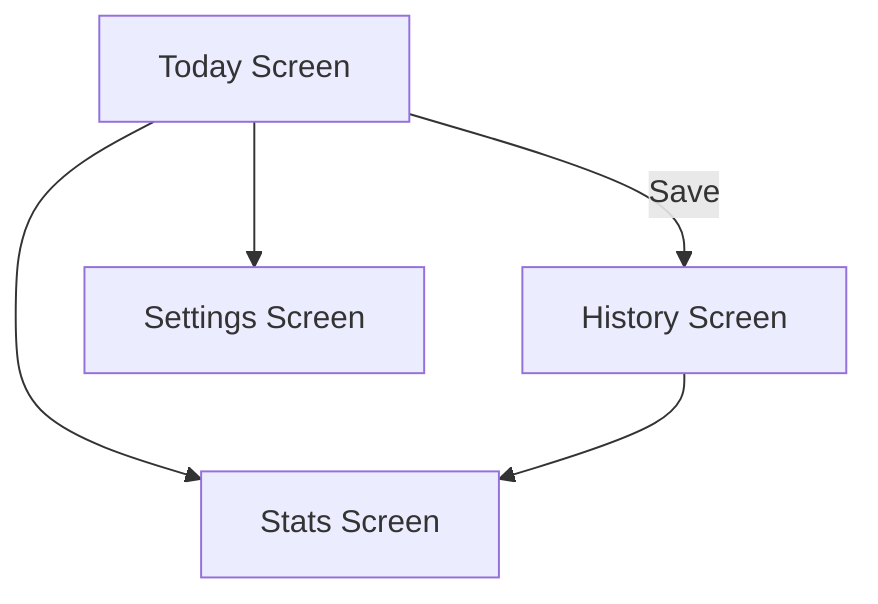

# Daily Mood Journal

A complete Flutter application for daily emotion tracking, journaling, analytics, and reminders.  
Designed with Provider state management, SQLite local database, and modular Flutter architecture.

---

## Features
- Daily mood logging with notes  
- History of past entries  
- Statistics dashboard (mood frequency & summary)  
- Light/Dark mode  
- Offline-first local SQLite storage  
- Clean modular architecture (models, providers, screens, widgets)

---

## Tech Stack
- **Flutter**  
- **Dart**  
- **Provider** (state management)  
- **SQLite (sqflite)**  

---

## Project Structure
```
lib/
├── main.dart
│
├── models/
│   └── mood_entry.dart
│
├── providers/
│   ├── mood_provider.dart
│   └── settings_provider.dart
│
├── screens/
│   ├── today_screen.dart
│   ├── history_screen.dart
│   ├── stats_screen.dart
│   └── settings_screen.dart
│
├── widgets/
│   ├── entry_card.dart
│   └── mood_picker.dart
│
├── db/
│   └── app_database.dart
│
└── utils/
    └── date_utils.dart
```

---

## Component Overview

### **Models**
- **mood_entry.dart** — MoodEntry model with id, date, moodValue, note  
  Includes: `toMap()`, `fromMap()` for database usage  

### **Providers**
- **mood_provider.dart** — CRUD for mood entries + today's entry logic  
- **settings_provider.dart** — Theme mode

### **Screens**
- **today_screen.dart** — Record today’s mood  
- **history_screen.dart** — List of past entries  
- **stats_screen.dart** — Mood frequency summary  
- **settings_screen.dart** — Theme

### **Widgets**
- **entry_card.dart** — Mood log card for history  
- **mood_picker.dart** — Mood selector UI  

### **Database**
- **app_database.dart** — SQLite initialization, create table, insert/query moods  

### **Utils**
- **date_utils.dart** — Date formatting helpers  

---

## UI Flow (Mermaid)


---

## Database Schema
### **Table: mood_entries**
| Column     | Type    |
|------------|---------|
| id         | INTEGER PRIMARY KEY |
| date       | TEXT    |
| mood  | INTEGER |
| note       | TEXT    |

---

## Getting Started

### Install packages:
```
flutter pub get
```

### Run:
```
flutter run
```

